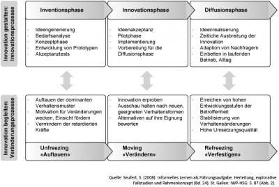

## Ziel- und Implementierungsstrategie festlegen

Veränderungsstrategien beinhalten konzeptionelle Festlegungen hinsichtlich des angestrebten Veränderungsziels (der *Zielstrategie*), sowie in Bezug auf die Vorgehensweise, wie dieses Veränderungsziel erreicht werden soll (der *Implementierungsstrategie*).

„Was soll mit der Veränderung erreicht werden?“ Diese Frage bildet den Ausgangspunkt für die **Entwicklung einer Zielstrategie** zu einem Veränderungsvorhaben. Das angestrebte Veränderungsziel sollte dazu beitragen, relevante Probleme zu lösen. Darüber hinaus sind bei der Entwicklung einer Zielstrategie möglichst alle wichtigen Anspruchsgruppen zu berücksichtigen.

Eine nachhaltige Einführung von E-Learning (in welcher Ausprägung auch immer) erfordert eine Einpassung in die Strategie und das Angebotsportfolio des Bildungsdienstleisters beziehungsweise der -dienstleisterin – dies gilt für Hochschulen ebenso wie für Personalentwicklungs- oder Learning-and-Development-Bereiche in Unternehmen und Organisationen.

- Welche Ziele, welche Zielgruppen und welche Angebote stehen im Vordergrund?
- Geht es um eine Neuausrichtung als Bildungsanbieter/in, beispielsweise als Businesspartner/in für einzelne Geschäftsbereiche?
- Geht es um eine Revitalisierung der Gesamtorganisation, beispielsweise durch eine Initiative zur Umsetzung einer lernenden Organisation?

### In der Praxis: Neue Wege zum Erwerb von Arbeitsprozesswissen ( Lang &amp; Pätzold, 2004)

Arbeitsprozesswissen beinhaltet sowohl das vorrangig über informelles Lernen erworbene Erfahrungswissen als auch das durch formelles Lernen entwickelte Theoriewissen und ist für ein kompetentes Handeln von Fachkräften unverzichtbar. Die Einführung von E-Learning kann auf die Entwicklung netzbasierter Lernumgebungen abzielen, um neue Wege zum Erwerb von Arbeitsprozesswissen zu eröffnen. Im Kontext beruflichen oder betrieblichen Lernens besteht dann eine zentrale Aufgabe bei der Organisation des Lernarrangements darin, Probleme, Inhalte, und Werkzeuge authentischer Arbeitsaufgaben möglichst durchgehend als Lernanlass heranzuziehen. Die Strategie für die Einführung von E-Learning beziehungsweise netzbasierter Lernumgebungen kann sich dabei auf zwei übergreifende Ziele beziehen, die klar definiert und operationalisiert werden können: 1) das Erfahrungslernen durch das erzeugte Erfahrungswissen systematisch mit Theoriewissen zum Arbeitsprozesswissen zu verbinden und 2) dauerhaft angelegte Communities of Practice zu etablieren, um Gelegenheiten zum systematischen Erfahrungslernen zu bieten (Erwerb sowie Reflexion von eigenen Erfahrungen, sozialer Austausch, Entwicklung von Problemlösungen mit anderen Lernenden, Dialog mit Expertinnen und Experten, etc.).  
</blockquote>

Die Kernfrage bei der **Entwicklung einer Implementierungsstrategie** lautet: „Wie soll das angestrebte Veränderungsziel erreicht werden?“ Zentrale Gestaltungsfelder bei der Implementierungsstrategie sind

1. die Festlegung einer Implementierungsrichtung,
2. die zeitliche Planung des Implementierungsprozesses,
3. die Klärung von Verantwortlichkeiten und Ressourcen sowie
4. die Festlegung von Gestaltungsprinzipien.

Insbesondere geht es darum, Wege zur Gestaltung von Veränderungsprozessen aufzuzeigen, das heißt „strategische Initiativen zum Leben zu bringen“ (Müller-Stewens &amp; Lechner, 2005, 589).

Tendenziell werden Ideen zur Verbesserung einzelner Bildungsprozesse eher in Bottom-Up-Strategien entwickelt. Das Innovationsprojekt setzt an Bestehendem an und gewährleistet, dass die Verbesserung im Rahmen der vorhandenen Handlungskompetenzen erfolgt. Der Ordnungsrahmen aus Struktur, Kultur und Routinen bleibt bestehen und wird lediglich angepasst (Capaul &amp; Seitz, 2011, 604). Eine grundsätzliche Bedrohung von Handlungsprioritäten oder Werthaltungen entsteht dabei kaum und es ergeben sich wesentlich geringere Risiko- und Konfliktpotenziale.

Bei Erneuerungsprozessen wird hingegen häufig eine Kombination aus Top-Down- und Bottom-Up-Strategien favorisiert. Reine Bottom-Up-Entwicklungen können oft nicht genügend Umsetzungsmacht mobilisieren, um die mit radikalen Umbrüchen verbundenen Widerstände zu bewältigen. Und reine Top-Down-Ansätze verfehlen häufig ihr Ziel, da sie die Beteiligten zu wenig ins Boot holen und nicht genügend Umsetzungskraft mobilisieren können.

## Innovations- und Veränderungsprozesse begleiten

Im Rahmen der Einführung von E-Learning sind einerseits Innovations-/Gestaltungsprozesse und andererseits Veränderungsprozesse zu bewältigen. Beide Prozessdimensionen lassen sich durch drei miteinander verbundene Phasen mit jeweils unterschiedlichen Zielsetzungen charakterisieren (vgl. Abb. 2):

1. *Inventionsphase &amp; Auftauen:* Aus der Gestaltungsperspektive geht es hier darum, neue Ideen zu generieren, Innovationen zu initiieren und Innovationen bis zu einem „mockup“ oder eine „Pilotversion“ einer neuen Lernumgebung zu entwickeln. Aus der Veränderungsperspektive steht das „Auftauen“ als dominantes Verhaltensmuster im Vordergrund, weil hierdurch grundlegende Voraussetzungen für Experimentieren mit und Pilotieren von neuen Lernformen geschaffen werden.
2. *Innovations-/Implementierungsphase &amp; Verändern*: Aus der Gestaltungsperspektive geht es hier darum, Inventionen zu Lernformen und Lernaktivitäten so weiterzuentwickeln und so viel Akzeptanz dafür zu schaffen, dass sie (in begrenzten Bereichen) erprobt werden können. Aus der Veränderungsperspektive geht es nicht nur um das Erproben der Lern-Innovation, sondern auch um das Entwickeln von neuen Handlungsmustern bei Lernaktivitäten und die Bewertung von möglichen Alternativen zur Innovation.
3. *Diffusionsphase &amp; Verfestigen*: Aus der Gestaltungsperspektive steht in dieser Phase die Verbreitung der Innovation in der Gesamtorganisation im Vordergrund (zum Beispiel die breite Umsetzung und Nutzung kollaborativen Lernens in Online-Lern- und Praktiker/innen-Communitys). Es geht darum, von einer zeitlich und räumlich begrenzten Pilotierung zu einem flächendeckenden Regelbetrieb zu kommen. Aus der Veränderungsperspektive geht es um die Verfestigung und das Konsolidieren neuer Vorgehens- und Verhaltensweisen auf einem höheren Entwicklungsniveau.

Abb. 2 : Phasen der Gestaltung/Begleitung von Innovations- und Veränderungsprozessen

Diejenigen, die Innovations- und Veränderungsprozesse im Bildungsbereich vorantreiben wollen, müssen noch zwei weitere Aspekte beachten. Erstens: „Die Tendenz politischer Entscheidungsträger und Vorgesetzter, das Interesse zu verlieren, sobald die Entwicklungsarbeiten abgeschlossen sind, kann verhängnisvoll auf die Innovation wirken“ (Capaul, 2005, 5). Nachlassende beziehungsweise fehlende Unterstützung oder Ressourcenausstattung in den Phasen der Diffusion und Verfestigung/Stabilisierung kann aber dazu führen, dass die Einführung von E-Learning auf wenige insulare Bereiche beschränkt bleibt und keine breite beziehungsweise nachhaltige Veränderung von Lernverhalten stattfindet. Daraus ergeben sich dann besondere Anforderungen an die Projektorganisation und das Projektmanagement. Zweitens weisen Hall und Hord darauf hin, dass bei Innovationsprozessen das Wissen, die Einstellungen und die Fertigkeiten der Personen, die von der Innovation betroffen sind, zentrale Erfolgsfaktoren darstellen. Denn erst wenn die Einzelpersonen die Innovation auch im angestrebten Sinne umsetzen, wird die Innovation erfolgreich. Viele Innovationen scheitern, weil bei Innovationsvorhaben diesen personellen Faktoren zu wenig Beachtung geschenkt wird ( Hall &amp; Hord, 2001, 5-7).
